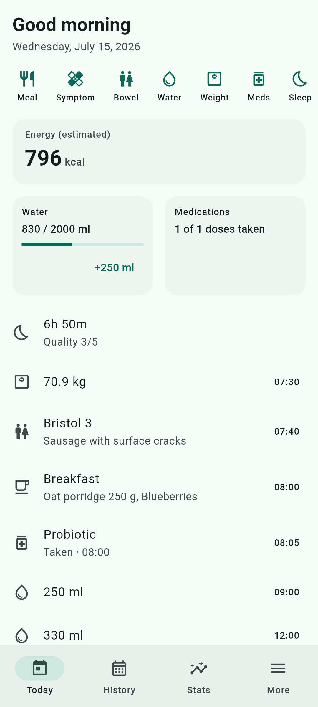
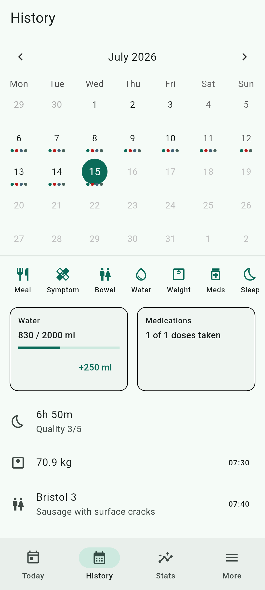
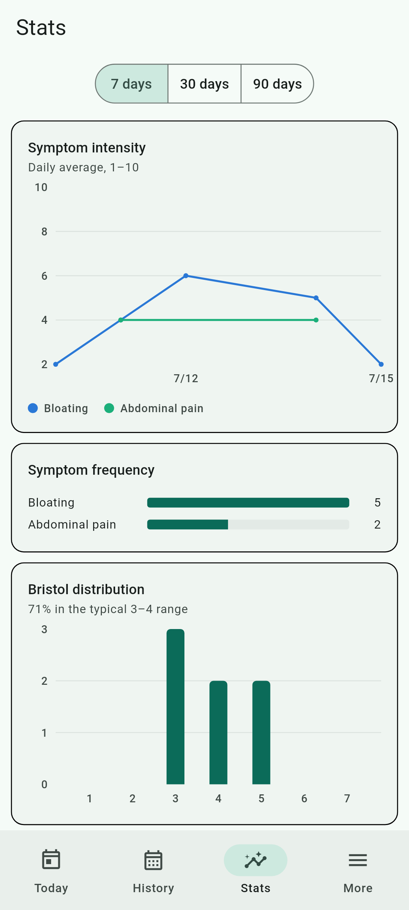
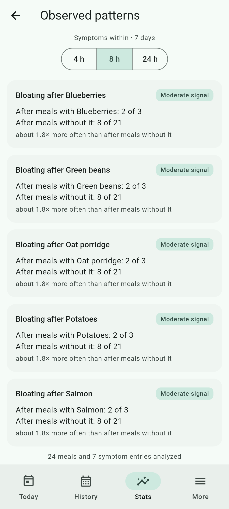

# Gut Journey

> A local-first health diary for people with functional gastrointestinal
> disorders (like IBS) following a Low FODMAP or other monitored nutrition
> path. Track meals, symptoms, bowel movements, weight, medications, water,
> sleep and activity — and turn scattered notes into insight you can discuss
> with your doctor.

[](https://github.com/Innuendo97/gut-journey/actions/workflows/ci.yaml)

## ⚠️ Medical disclaimer

Gut Journey is a **personal diary, not a medical device**. It does not provide
medical advice, diagnosis, or treatment, and any pattern it surfaces is an
observation — never a causal or clinical claim. Always consult your physician
or a registered dietitian about your symptoms and diet.

## Why

People following a monitored nutrition path today track meals, symptoms,
bowel movements, weight and medications across notes apps, spreadsheets and
paper. That fragmentation makes it nearly impossible to spot correlations
between food and symptoms, or to share a complete picture with a doctor.
Gut Journey keeps everything in one place, fully on your device.

## Screenshots

| Today | History | Stats | Patterns |
| :---: | :---: | :---: | :---: |
|  |  |  |  |

## Features

| Feature | Status |
| --- | --- |
| Meals & drinks with a personal food library (autocomplete, favorites) | ✅ |
| Symptoms with intensity (presets + custom types) | ✅ |
| Bowel movements with Bristol Stool Scale | ✅ |
| Weight, medications & adherence, water, sleep, activity | ✅ |
| History calendar with back-filling | ✅ |
| Statistics: trends, distributions, summaries | ✅ |
| Italian + English | ✅ |
| Backup & restore (database file + JSON export) | ✅ |
| PDF export for your doctor | ✅ |
| Observed meal ↔ symptom patterns (time-window comparison) | ✅ |
| Low FODMAP reintroduction-phase module | ✅ |
| Multi-device sync | 🔮 Planned |

## Design principles

- **Local-first.** Your health data never leaves your device. No account, no
  cloud, no tracking.
- **Fast entry.** Logging a full day takes a couple of minutes: every tracker
  logs from a bottom sheet in three taps or fewer.
- **Condition-agnostic core.** Nothing in the data model hardcodes IBS or
  FODMAP; condition-specific features are modular layers on top, so the app
  adapts to other monitored-health contexts.

## Architecture

Feature-first Flutter app with a clear separation of UI, domain logic and
persistence:

```
UI (Flutter widgets)  →  Riverpod providers  →  Repositories  →  Drift (SQLite)
```

```
lib/
├── app/          # MaterialApp, router (go_router), theme
├── core/         # Drift database, shared domain values, shared widgets
├── features/     # one folder per feature: domain/ data/ presentation/
└── l10n/         # ARB translation files (en = template, it)
```

Key choices: [Riverpod](https://riverpod.dev) for state/DI (providers declared
by hand, no codegen), [Drift](https://drift.simonbinder.eu) over SQLite for
typed relational queries and first-class migrations, `go_router` for
navigation, `fl_chart` for charts, `freezed` for immutable domain models.

## Getting started

```sh
flutter pub get
dart run build_runner build --delete-conflicting-outputs
flutter gen-l10n
flutter run
```

## Testing

```sh
flutter test
```

Repositories are tested against a real in-memory SQLite database (no mocks),
domain logic with pure unit tests, and the main entry flows with widget tests.

## Contributing

See [CONTRIBUTING.md](CONTRIBUTING.md) — including how to add a new tracker
feature or a translation.

## License

[MIT](LICENSE)
